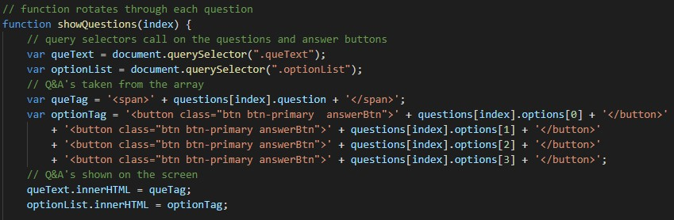
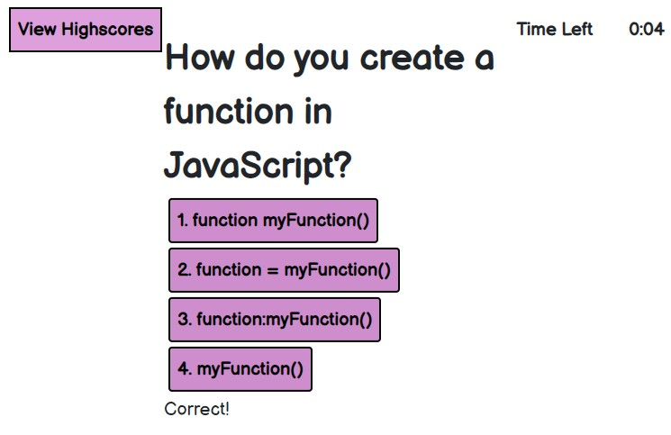

# Code Quiz

## About Project
The goal for this project was to create a quiz with a countdown timer that had a time penalty for evey incorrect answer the user selected. It also needed to have the ability to store and view the user's high scores. To view this project, [click here](https://silvia-taliana.github.io/code-quiz/). 

## Installation
The technologies used include CSS, HTML and JavaScript. First of all, an array of questions was created. Event listeners were used to start the quiz when the user clicked the start button. The timer function would also start as soon as the quiz appeared. The following function was used to rotate through all the questions and answer options in the array: 

In order to have a high score page at the end, the users score and initials were saved in to local storage and then retrieved for the final screen where high scores are displayed. 

## Usage
Here is an example of the working application:

## License 
Creative Commons Attribution 4.0 International Public License

MIT License